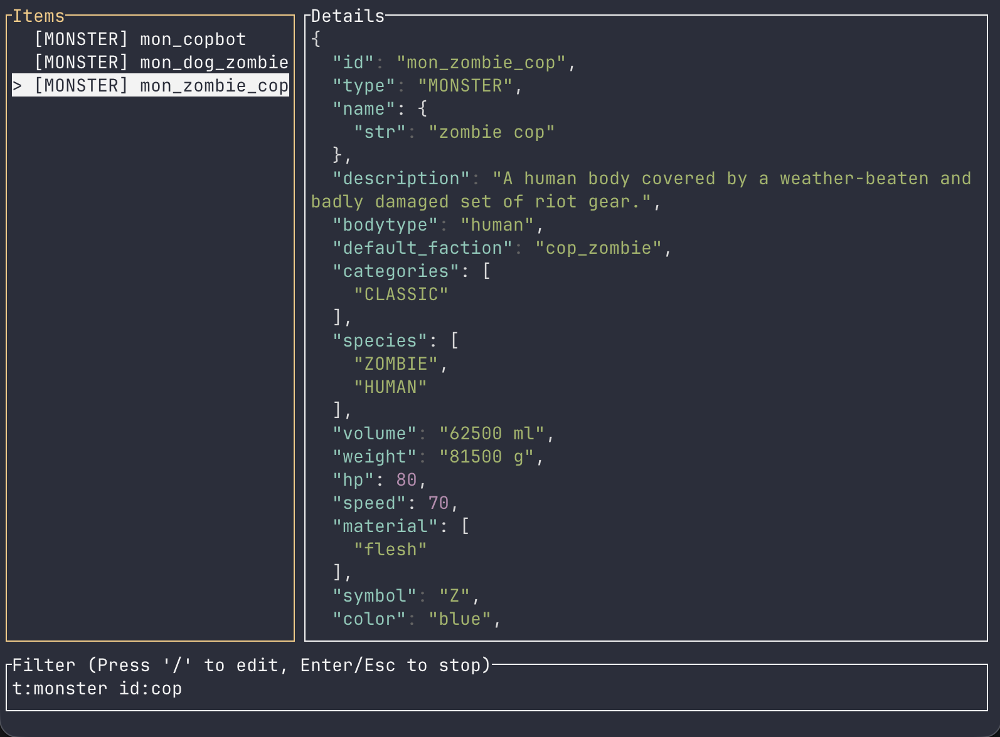

# cbn-tui 🚀

Terminal User Interface (TUI) browser for **Cataclysm: Bright Nights** JSON data.



## ✨ Features

- **Blazing Fast**: Instantly browse and search through thousands of game items, monsters, and definitions.
- **Automatic Data Management**: Automatically download and cache game data directly.
- **Advanced Search Syntax**: Powerful filtering with support for specific fields and combined logic:
  - `id:zombie` or `i:zombie` - Filter by ID.
  - `type:MONSTER` or `t:MONSTER` - Filter by record type.
  - `category:weapon` or `c:weapon` - Filter by category.
  - `bash.str_min:10` - Deep field search using dot-notation.
  - `term1 term2` - Combine multiple terms (AND logic).
- **Syntax Highlighting**: Beautifully formatted JSON details with syntax coloring for keys, strings, numbers, and booleans.
- **Seamless Navigation**: Switch focus between the item list, details pane, and search bar using standard keyboard shortcuts.
- **In-app Version Switcher**: Pick stable, nightly, or tagged releases without restarting the app.

## ⌨️ Controls

| Key                   | Action                                        |
|-----------------------|-----------------------------------------------|
| `q` / `Esc`           | Quit Application                              |
| `/`                   | Focus Search Bar                              |
| `Tab` / `Shift-Tab`   | Cycle focus between List, Details, and Search |
| `↑` / `↓`             | Move selection or scroll                      |
| `PageUp` / `PageDown` | Scroll faster (10 items at a time)            |
| `Enter`               | Confirm or exit input focus                   |
| `Ctrl+G`              | Open game version switcher                    |

## 🚀 Usage

### Automatic Data Download
Launch the application and specify a game version. It will automatically download and cache the data for you:
```bash
cbn-tui --game nightly
```

### Other Options
- **List available game versions**: `cbn-tui --game-versions`
- **Force refresh cached data**: `cbn-tui --game stable --force`
- **Use a custom JSON file**: `cbn-tui --file path/to/your/data.json`
- **Use a local source directory (In-source mode)**: `cbn-tui --source path/to/cdda-data/` (Hot reload with `Ctrl-R`)

## 📄 License
Distributed under the MIT License. See `LICENSE` for more information.
